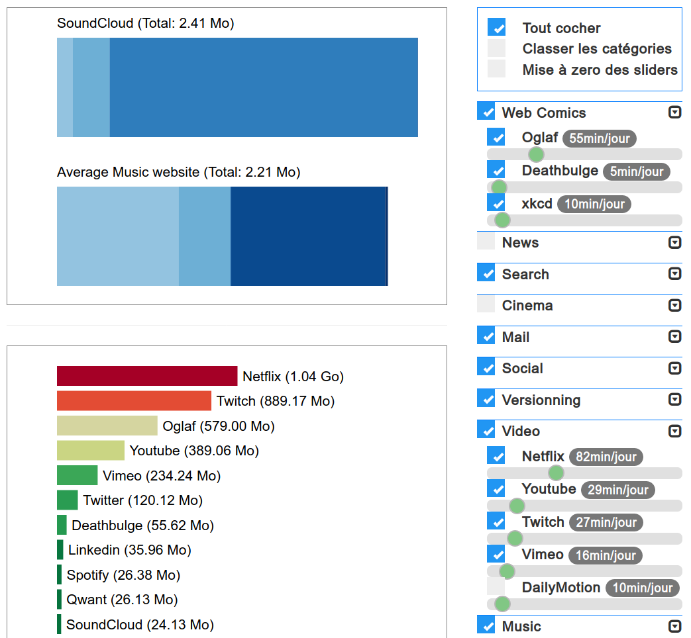

# Websites data consumption (Consommation de données des sites web)

  

This project was done at [Université Claude Bernard Lyon 1](https://www.univ-lyon1.fr/) (Lyon, France) 
for the [Data Visualization](https://lyondataviz.github.io/teaching/lyon1-m2/2017/) course of the 
[Artificial Intelligence Master](http://master-info.univ-lyon1.fr/IA/)'s Degree (2019).

Ce projet a été réalisé dans le cadre de l'UE [Data Visualisation](https://lyondataviz.github.io/teaching/lyon1-m2/2017/) du 
[Master 2 Intelligence Artificielle](http://master-info.univ-lyon1.fr/IA/) 
de [l'Université Claude Bernard Lyon 1](https://www.univ-lyon1.fr/) (2019).

## Description ()

In a world where data is sometimes still limited and results in significant
energy consumption, one could wonder how to use less of it. 

This visualisation aims to help you rank websites from best to worst in the amount of data they use, 
and adapt to your everyday use with customizable options.

## Description ()

En considérant que l'utilisation de données est encore aujourd'hui limitée dans certains contextes et qu'elle 
représente une consommation d'énergie significative, on peut être amené à se demander comment la restreindre.

Cette visualisation offre un classement de plusieurs catégories de sites en fonction des données qu'ils utilisent, 
et permet d'identifier les meilleurs et les pires dans ce domaine.
